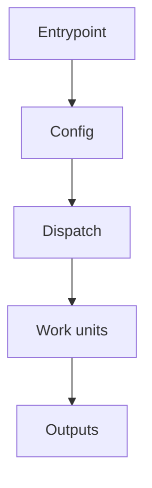

# Project Orientation Graph

## Goal

Produce a compact repo map that helps a human regain orientation. Prefer a few
verified high-value nodes and arrows over broad file inventories.

## Workflow

1. Ground the map in source evidence.
   - Inspect the top-level tree with `rg --files` or `find`.
   - Read likely entrypoints, package manifests, CLI/app startup files, config loaders, routers, bridges, and orchestrators.
   - Check existing docs before adding a new one; if a dense/generated map exists, create a smaller companion instead of replacing it.

2. Identify the project spine.
   - Entrypoints: CLI commands, web app boot, service main, package scripts, background jobs.
   - Configuration: YAML/JSON/env/schema/dataclass/model loading and validation.
   - Dispatch: registries, routers, dependency injection, plugin maps, task queues, or string-keyed adapters.
   - Work units: pipeline steps, handlers, services, pages, screens, jobs, or domain modules.
   - State/output: databases, files, cache/state manifests, reports, generated artifacts, API responses.
   - Tests: mention only the suites that help a reader verify the main flow.

3. Keep the graph deliberately small.
   - Target 8-14 nodes for a first-pass orientation map.
   - Merge many files into a domain node when they share one role.
   - Separate control flow from config/data flow when that makes the map easier to read.
   - Highlight the central join point, such as a route name, step type string, registry key, event name, or API method.

4. Write an artifact only when asked to create/update docs.
   - Prefer `docs/project-graph.md` unless the repo has a more obvious docs location.
   - Use Mermaid for the main graph when Markdown docs are appropriate.
   - Include a short "read this first" path with the few files a human should open in order.
   - Add a README link only if discoverability matters and the README already links to docs or has an overview section.

5. Validate lightly.
   - Re-read the artifact.
   - Check that referenced paths exist.
   - For Markdown/Mermaid, check obvious syntax issues.
   - Do not run full tests for documentation-only changes unless the repo has a docs validation command.

## Output Shape

For a documentation artifact, use this structure:

````markdown
# <Project> Project Graph

One short paragraph explaining the purpose.



## The Main Idea

One short explanation of the central execution model and the most important join point.

## Control And Data Flow

| Layer | What to read | Why it matters |
| --- | --- | --- |
| Entrypoints | `path/to/main` | Starts the app. |

## Read This First

1. `path/to/first`
2. `path/to/second`

## What This Map Leaves Out

Short note that this is intentionally not a full dependency graph.
````

## Rules

- Prefer local evidence over memory.
- Do not dump every file or every import.
- Do not generate or update dense symbol maps unless the user explicitly asks.
- Do not refactor while making the map.
- If the user asks for a plan first, plan the artifact and decisions before editing.
- If a file already contains unrelated user changes, work around them and do not revert them.
