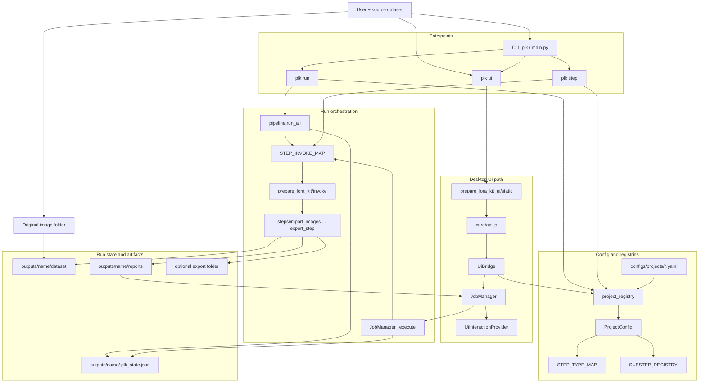
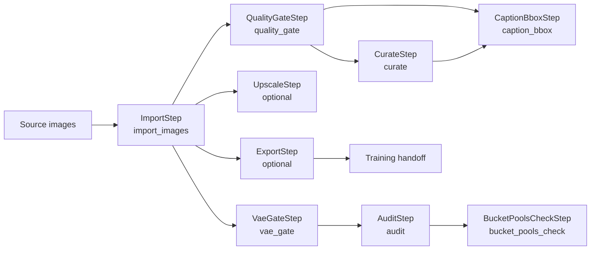

# PrepareLoraKit Project Graph

This is the small map to read before the generated symbol map. It shows the
few connections that explain how the app hangs together.

Open the standalone HTML view at [`docs/project-graph.html`](project-graph.html)
when you want the same information as a browser page.

## The Main Idea

PrepareLoraKit has one pipeline engine with two ways to start it:

- The CLI loads a project config and calls `prepare_lora_kit.pipeline.run_all`.
- The desktop UI starts through `plk ui`, serves the static frontend, and calls
  `prepare_lora_kit_ui.bridge.UiBridge`.
- `UiBridge` hands runs to `prepare_lora_kit_ui.runner.manager.JobManager`.
- Both the CLI path and UI path eventually dispatch step types through
  `prepare_lora_kit.invoke.STEP_INVOKE_MAP`.
- The actual work lives in named step packages under `prepare_lora_kit/steps/`.

The important join is the step type string. A project YAML says
`type: CaptionBboxStep`; `STEP_TYPE_MAP` says which config dataclass parses it; and
`STEP_INVOKE_MAP` says which adapter runs it.

## Pipeline Stage Order

The authoritative step order and dependency graph come from
`prepare_lora_kit_pipeline/configuration.py`. Export only depends on import, so
it can run even when no image-changing step has been applied.

## Control And Data Flow

| Layer | What to read | Why it matters |
| --- | --- | --- |
| Entrypoints | `main.py`, `prepare_lora_kit/cli/` | Registers `plk` commands and starts CLI or UI runs. |
| Frontend | `prepare_lora_kit_ui/static/app.js`, `prepare_lora_kit_ui/static/core/api.js` | Boots the static UI and calls the pywebview bridge. |
| UI bridge | `prepare_lora_kit_ui/bridge.py` | Exposes Python methods to `window.pywebview.api`. |
| UI runner | `prepare_lora_kit_ui/runner/manager.py` | Adds job status, step selection, UI interactions, cancellation, and logs. |
| Config | `prepare_lora_kit/project/base.py`, `prepare_lora_kit_pipeline/configuration.py` | Loads project YAML, validates step order, and maps step types to config classes. |
| Dispatch | `prepare_lora_kit/pipeline.py`, `prepare_lora_kit/invoke/__init__.py` | Walks the configured pipeline and calls the right step adapter. |
| Work | `prepare_lora_kit/steps/import_step` through `prepare_lora_kit/steps/export_step` | Implements the image preparation stages. |
| State/output | `prepare_lora_kit/utils/state.py`, `outputs/<name>/` | Tracks completed steps and stores the working dataset, reports, and optional export. |

## Read This First

1. Start with `README.md` for the user workflow and output layout.
2. Read `prepare_lora_kit/pipeline.py` to see the core CLI run loop.
3. Read `prepare_lora_kit/invoke/__init__.py` to see which step type calls which adapter.
4. Read `prepare_lora_kit/project/base.py` to see how project YAML becomes `ProjectConfig`.
5. For UI behavior, read `prepare_lora_kit_ui/bridge.py`, then
   `prepare_lora_kit_ui/runner/manager.py`.

## What This Map Leaves Out

This is not a full dependency graph. It intentionally leaves out most helper
modules, test files, generated docs, and third-party integration code. Use a
symbol-level code map only after you know which area you are looking at.
